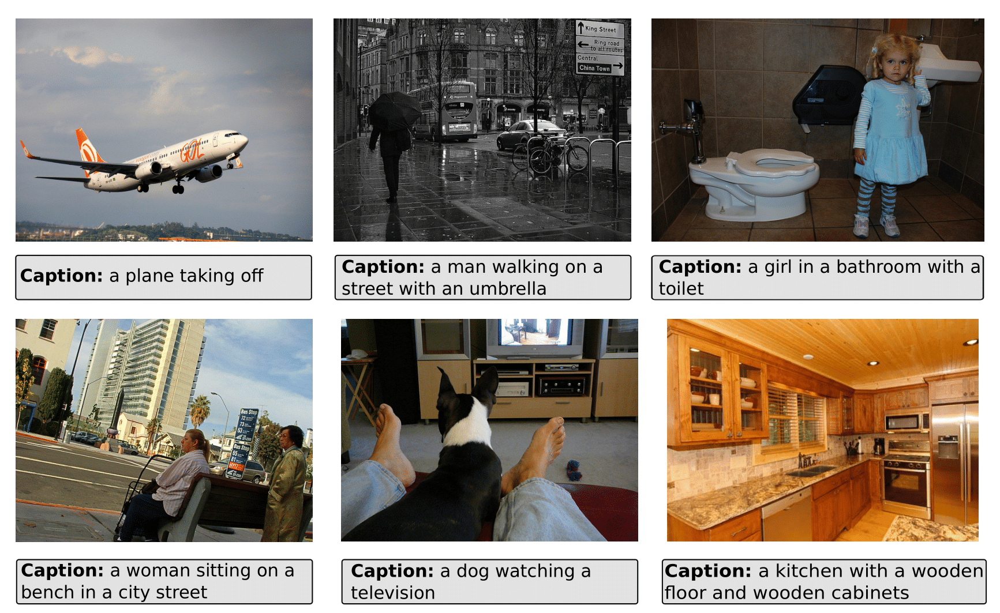

# SITTA: A Semantic Image-Text Alignment for Image Captioning

Fabian Paischer<sup>1 2</sup>,
Thomas Adler<sup>1</sup>,
Markus Hofmarcher<sup>1</sup>,
Sepp Hochreiter<sup>1 2 3</sup>


<sup>1</sup> LIT AI Lab, Institute for Machine Learning, Johannes Kepler University Linz, Austria <br/>
<sup>2</sup> ELLIS Unit Linz  
<sup>3</sup> Institute of Advanced Research in Artificial Intelligence (IARAI)

---

**[SITTA: A semantic Image-Text Alignment for Image Captioning]()** is a lightweight mapping from image to text domain that enables conditioning pretrained Language Models on visual input.
See below some examples for captions created with SITTA for sample images of the MS-COCO validation set.



---

## Reproducing our Pipeline

To reproduce our results, first download the annotations for MS-COCO and Flickr30k via

    mkdir annotations && cd annotations
    wget https://cs.stanford.edu/people/karpathy/deepimagesent/caption_datasets.zip
    unzip caption_datasets.zip
    cd ..

Then download the MS-COCO data and the Flickr30k data and store them in ```data/coco```, and data ```flickr30k```, respectively.

    mkdir datasets && cd datasets
    mkdir mscoco && cd mscoco
    wget http://images.cocodataset.org/zips/train2014.zip
    unzip train2014.zip
    wget http://images.cocodataset.org/zips/val2014.zip
    unzip val2014.zip
    cd ../..
    
Also, apply for access to the [Flickr30k dataset](https://shannon.cs.illinois.edu/DenotationGraph/) and save the images to ```./datasets/flickr30k```.

Then create a conda environment with the required packages 

    conda env create -f env.yml

After installing the conda environment parse both datasets by

    cd data_prep
    python parse_coco.py
    python parse_flickr30k.py

For computing the different mappings, first, you will need to extract the CLIP and language embeddings for Llama (or other language models) 

    python prepare_embeddings.py
    
This will run for a while and extract token embeddings for all CLIP backbones and save them to ```data/```.
Next you can train the mappings via *lexical matching* by running

    cd ..
    python train_lexical_matching.py
    
Before running the computation for the *external datasets* method, you will need to run

    python -m spacy download en_core_web_sm
   
This will download and install the english spacy pipeline used for stop-word removal.
Then execute

    python train_external_dataset.py
    
By default the above mappings will be computed for Llama, but you can specify other language models via the ```--lm``` command line argument.
Further you can specify the fraction of the MS-COCO dataset to be used for the computation of the mapping using the ```--fraction``` command line argument.
Currently our code supports ```Llama, T5-v1_1, FLAN-T5, GPT-J, GPT-JT```.
If you want to create mappings for other language models, simply look up the respective huggingface identifier and add it to the code.

To run our retrieval experiments on mscoco, simply run 

    python retrieval_eval.py --mscoco

Finally, you can generate captions for the MS-COCO datasets on the respective test splits via

    python generate_captions.py --k 8 --l 40 --mscoco --vis-encoder RN50x64 --train-method linear_reg --decoding greedy    

For generating captions for the Flickr30k datasets, simply set ```--datadir data/flickr30/imgs_test.pkl``` and ```--flickr```.
The hyperparameters ```k``` and ```l``` denote the number of tokens provided in the prompt, and the number of random permutations, respectively.
Currently, generation supports ```greedy```, ```sampling```, ```nucleus```, and ```topk```.
In case you only have access to small GPUs (VRAM < 48GB) consider using 8-bit quantization by setting ```load_in_8bit=True``` while loading the model from the huggingface hub.

## Pretrained Mappings

We provide the pretrained mappings from all our results in the main paper in the ```models/``` directory.
These include ordinary least squares and procrustes mappings for Llama, GPT-J, GPT-JT, FLAN-T5, and T5-v1_1.


## Results on Retrieval Task

The results for our retrieval task can be found in the ```results/retrieval``` directory.

## Generated Captions

You can find all generated captions, as well as reported scores from our paper for all pretrained mappings and language models on both, the MS-COCO, and Flickr30k datasets, in the ```results/captioning``` directory.
Each result consists of a json file containing the captions for each image in the respective test set, and an associated ```.out``` file containing all computed evaluation metrics.
These metrics (BLEU, CIDeR-D, Rouge-L) are computed using the code from [here](https://github.com/tylin/coco-caption).
The corresponding annotation files for computing these scores can be found in the ```annotations/``` directory.

## LICENSE
MIT LICENSE


